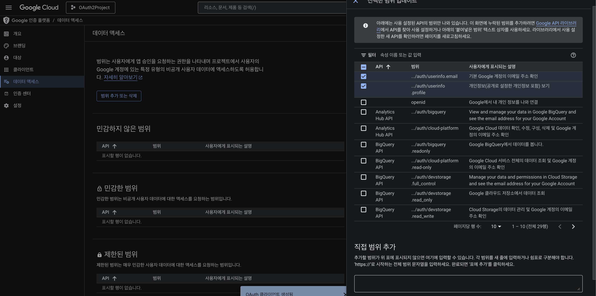

# OAuth2 구현
1. OAuth2 란 ?
  - Open Authorization 2.0의 축약어로 사용자의 비밀번호를 직접 받지 않고 구글 / 카카오와 같은 외부 서비스를 통해 사용자를 인증(Authentication)하는 표준 방법.

  - 깃허브 로그인할 때 구글 계정으로 로그인 버튼 눌렀을 때 일어나는 과정을 생각하시면 되겠습니다.

  - sign up(회원 가입)할 때는 결국 username/email 쓰고 비밀번호 입력하기는 했습니다. 그렇다면 회원 정보가 웹 사이트의 DB에 이미 존재하기는 하는데 로그인은 구글로 한다고 볼 수 있겠네요.

2. 왜 필요한가 ?
  - 기존 방식의 경우 사용자가 사이트에 username / password를 입력하게 되면 서버가 구글에 대신 로그인을 해줍니다 -> 그러면 사용자 비밀번호가 서버에 노출되는 형태.

  - OAuth2 방식의 경우 구글 로그인 페이지에서 구글에 로그인을 시도하고 -> 서버는 _허가 코드_ 를 받습니다. -> 그리고 이 허가 코드를 통해서 사용자 정보를 받아오게 되기 떄문에 : 구글만 구글 비밀번호를 확인할 수 있습니다.

  .png>)

- 이상에서 중요한 점은,
  1. 사용자는 구글 페이지에서 직접 로그인합니다.
  2. 구글은 Authorization Code를 주고, 이를 통해서 Access Token을 받게 됩니다.
  3. Access Token으로 구글 API에서 사용자 정보를 받아온 후에,
  4. 웹 사이트의 서버는 해당 사용자 정보와 일치하는 것을 발견한 후 웹 사이트의 JWT를 발급해서 프론트로 전달합니다.

## Backend 파트 작성
1. 어제 작성한 버전에서 default 검색이 되지 않는 의존성 추가하겠습니다.
```java
	implementation 'io.jsonwebtoken:jjwt-api:0.13.0'
	runtimeOnly 'io.jsonwebtoken:jjwt-impl:0.13.0'
	runtimeOnly 'io.jsonwebtoken:jjwt-jackson:0.13.0'
```
2. chrome 에서 gcp 검색 -> google cloud platform의 축약어 : gemini API key 발급받을 때 프로젝트 하나 생성했었다고 수업함.
3. 좌측 메뉴바 클릭 -> API 및 서비스 -> OAuth 동의 화면 클릭

승인된 리디렉션 URI
`http://localhost:8080/login/oauth2/code/google`


2. 데이터 범위(Scope 설정)


3. application.properties 작성
- jwt 예시 : 

4. Backend 상에서의 코드 작성
- Entity -> Repository -> DTO -> Service -> Security -> Config -> Controller

- 루트 패키지  내부에 이하의 패키지들을 생성하시오.
  1. config
  2. controller
  3. dto
  4. entity
  5. exception
  6. repository
  7. security
  8. service

5. Entity 작성
  - 주의사항 : User / OAuth2User 엔티티를ㄹ 별개로 나눕니다.
  - 이유 : provider 를 appliction.properties에 정의했는데, provider는 oauth2를 지원하는 '제공자' 입니다. 즉, google, naver, kakao, github 등이 있겠습니다. 근데 User 객체(혹은 테이블상에서의 row)가 google과 naver에 로그인 연동을 해놨다면 provider field에 값이 여러 개가 될 것이고, 아무 연동도 하지 않은 row의 경우에는 null 값이 들어가는 등 정리가 안될 겁니다.

  - 이상을 이유로 테이블을 두 개로 분리한 뒤에 OAuth2User에 user_id column을 설정하여 FK로 참조할 수 있도록 정규화할겁니다.

  - 정규화 이후에 한 명의 User(id가 100이라고 가정)가 google, naver에 모두 연동하면 oauth2_users에 user_id가 100인 row가 두 개 생성될겁니다.

6. Repository 작성 : 근데 이건 템플릿이다. 저희는 JPA를 쓰니까.
  - 이후에 custom method들을 정의했습니다. 해당 이유에 대해서는 전에 설명함.
  - Optional 쓰는 이유 : nullPointException 처리 안하게. -> 다만 .get() 하는 과정이 필요하다.
  - 복수의 특정 field를 사용하는 메서드 정의 이유 : 보안상.

7. DTO 정의할겁니다. 회원가입할 때는 field들 다 채워야하는데 로그인할 때는 email / password로만 할거고, google 로그인 구현하면 그 와중에 비밀번호 null 값인데 entity값이 다 일치하는 식으로 POST 요청을 보낼 필요가 없습니다. cardatabase에서 AccountCredential을 record로 정의했었습니다. -> 이번에는 class로 정의할 예정

- DTO 작성 시에 필요 정보들 넣어서 보낼 수 있도록 springboot 상에서 지원하는 validation 의존성 추가하겠습니다.
- MVN에서 validation 검색 후 -> Spring Boot Starter Validation 선택
- 버전은 지우고

